# User Management API
## Geting started:

#### clone the git repoitory to your desired path in your file system.
#### Run 'npm install' command on both frontend and backend folders.

#### Start either xampp or mysql-cli and run the commands present in /backend/config/databaseModel.sql

#### Usually .env file should not be pushed to git as it will have sensitive datas such as api keys and database credentials, but here i have pushed it to git for ease of use since it's only for development.

#### Go to /backend/.env and change your mysql credentials according to your setup. (Usually you might only need to replace DB_PASS to empty string if you have a normal setup)

#### Now start both the frontend and backend servers after navigating into respective directories. For frontend, run 'ng s' command. For backend, run 'npm start' command.

#### The server will be hosted in 'http://localhost:4200'

### NOTE: node app.js or nodemon app.js will not work in backed as this program requires certain parameters to be passed upon running node. Kindly start the app with 'npm start'

## Basic Assumptions

### Since the problem statement stated to use both nodejs and database, i decided to go with writing my own crud with a brand new database. Since it also said to make use of goRest api, if i make use of all of its methods i wouldnt be needing a backend so i only made use of its public api get function.

## OverView

### Once you visit the link you will be greeted by a  homescreen with a single button. click the button and navigate to user management.
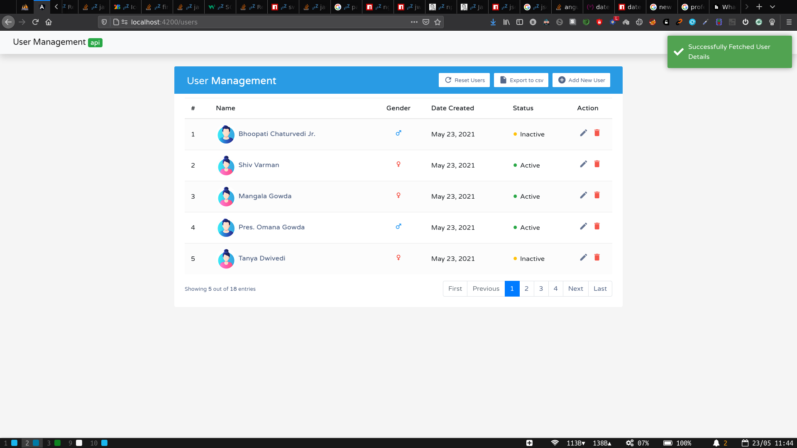

### In the beginning, when you navigate to user management for the first time and there are no datas present, it will automatically get the datas from goRest Api and save it in database.

### You can add Users by clicking 'Add New User Button'. It will open a Modal popup with user fields. All the fields are validated in both add and edit user modals either through html or typescript.
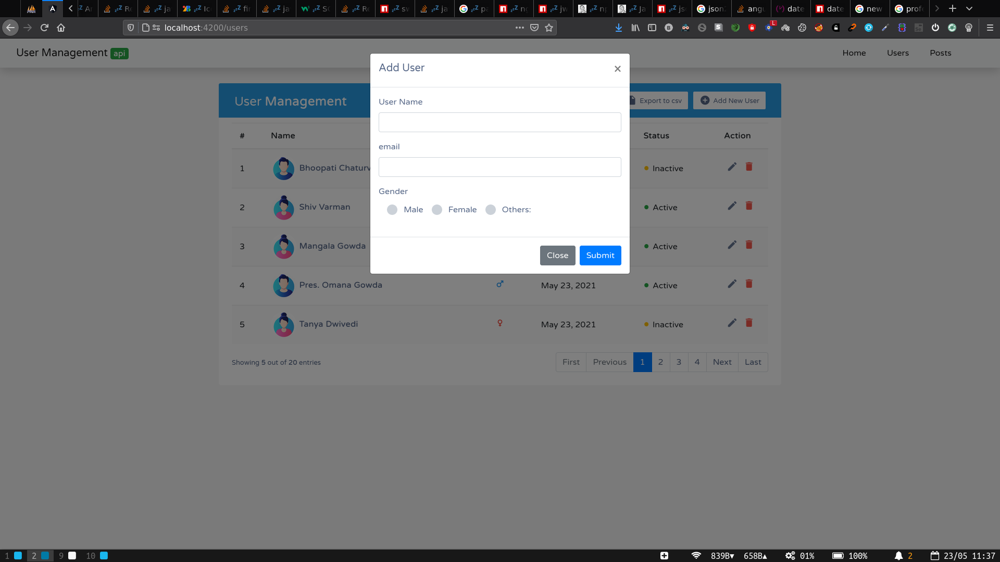
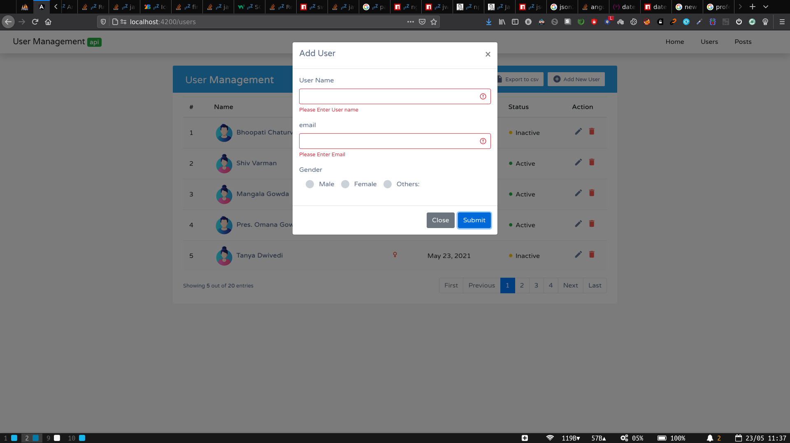

### For the users schema i have added an extra field as others for the Input just to make it a tad bit interesting.
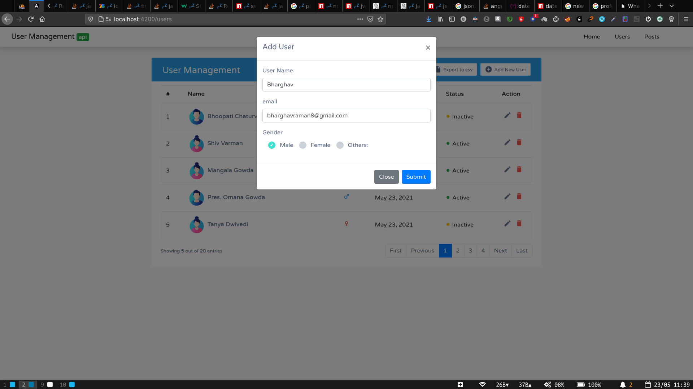
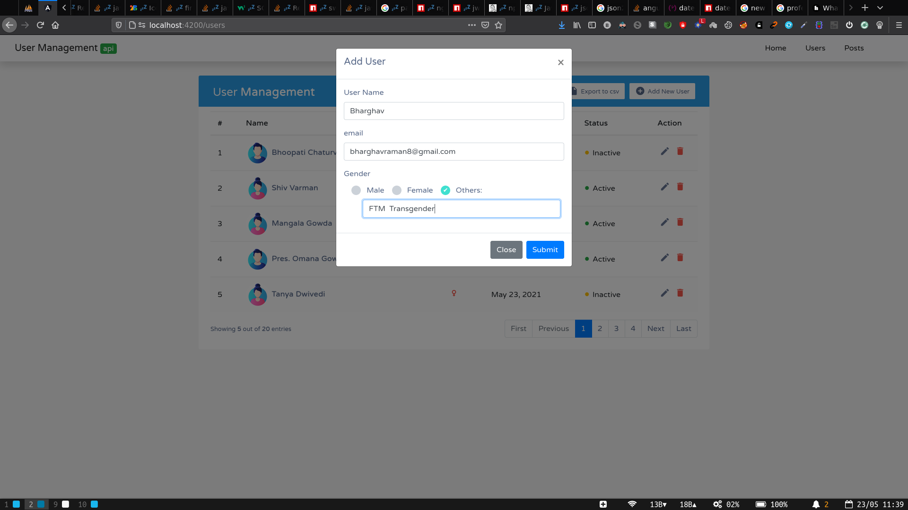

### Material Icons, avatar images and status colors has been added to make it look more attractive to the users.

### You will not be able to configure status as it will set to 'Active' by default whenever you add an user. Getting admin's input for status while adding user didn't make much sense.

### If you click on the pencil icon under Actions tab, an edit modal will popup with 4 fields. The extra field is to edit the status of the user to either 'Active' or 'Inactive'.
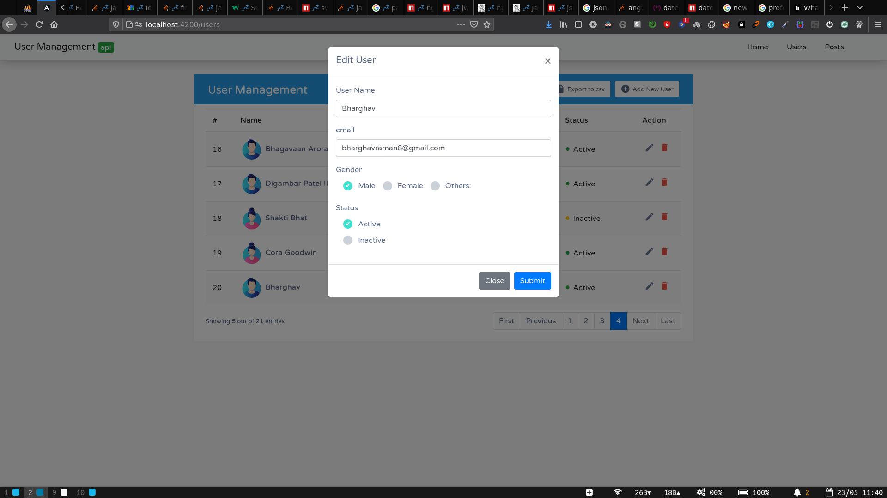

### Just beside the edit icon, there will be a delete icon which when pressed will open up a sweet alert to confirm the admin's choice and deletes the user.
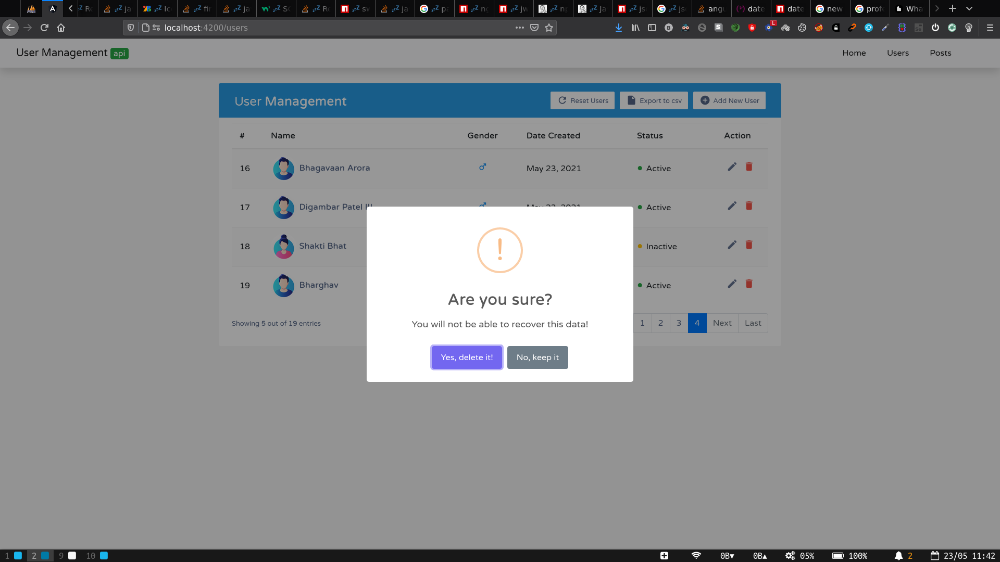
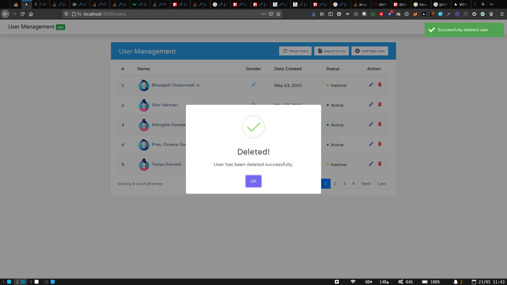

### Pagination has been added for easier readability.

### user's email will be show as a tooltip when hovered on user's name. showing email inside datatable did not look good. Tooltip for gender was added too
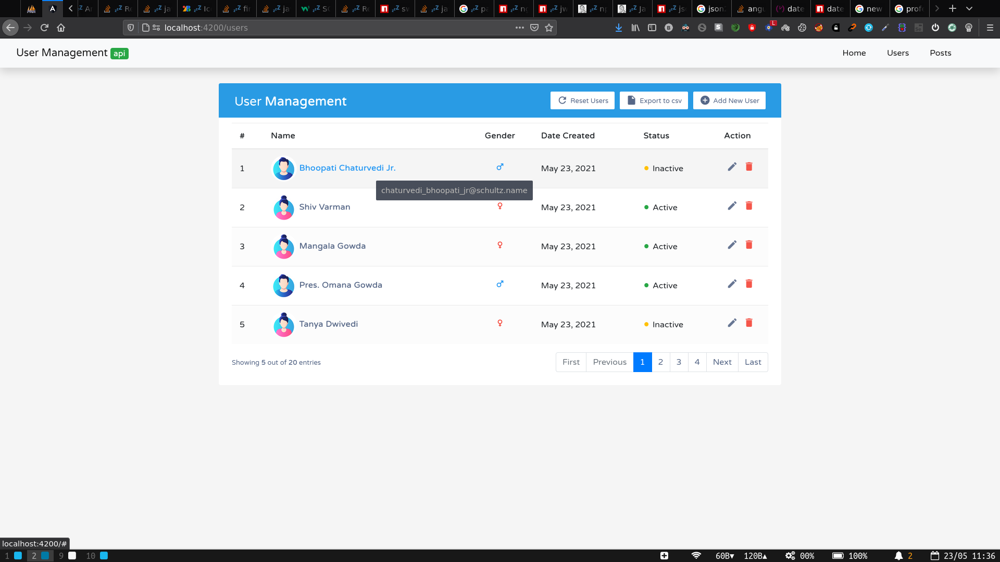
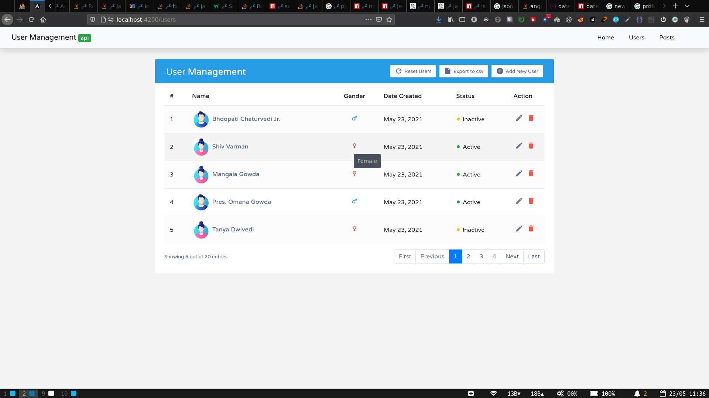

### There is an option to Export all the users data into csv and download it.
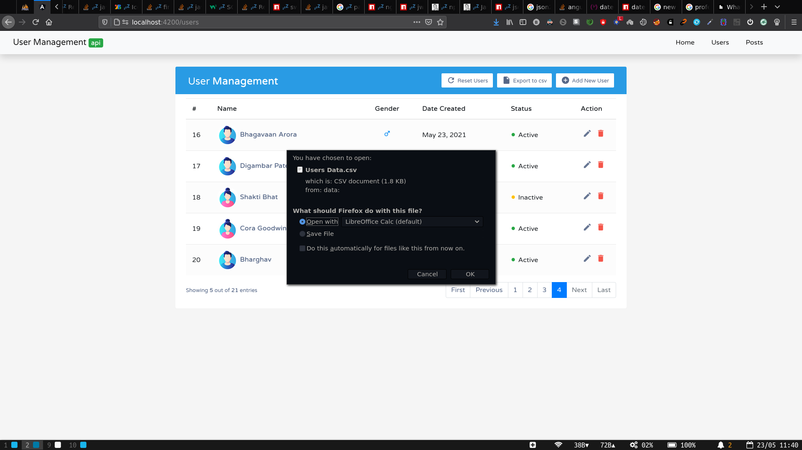

### Another feature has been added to reset users from goRest Api. If at all too many crud operations took place for testing, with a single click of a button, the data will be truncated and a set of clean data will be inserted in the database.

## on 23/05 I made use of json placceholder api for another problem statement. i have included that code as posts in the navigation bar. It only uses frontend with a fake json api server. Feel free to look into the code. The ui got messed up as i made use of  another bootstrap version in this projeect.